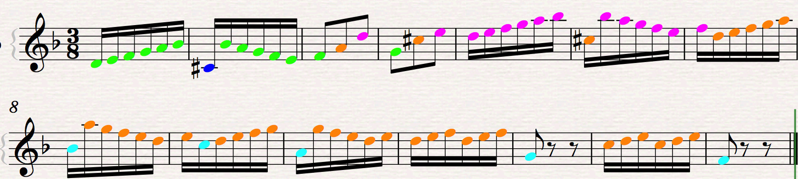

# Voice-Leading-Tracker

This project is designed to recognize and label internal voice leading lines in melodies. Even though a melody may be played on 1 instrument, one note at a time, it may have multiple discrete voices. This is important because we hear these almost as their own melodies. When there is a skip or jump in the countour of a melody, we seem to wait for when the melody returns to further develop the voice it departed from. 

A possible sample output for the first 2 systems of Bach's Invention #4. When there is a change in voice(as ive defined it) the color changes. The phenomenon where 2 voices are held at once is best explained by the second system, where the lower voice(teal) is returned to about once a bar.

##issues
when 2 internal voices go to the same place, its hard to say which voice takes precedence, or how it would be possible to illustrate that this has occurred.

![] (examples/invEx1.png)

When 1 voice (arguably) splits into 2, its hard to show what has happened. It may be best for clarity in this situation to label the note c in bar 9 orange rather than teal.

![] (examples/invEx2.png)